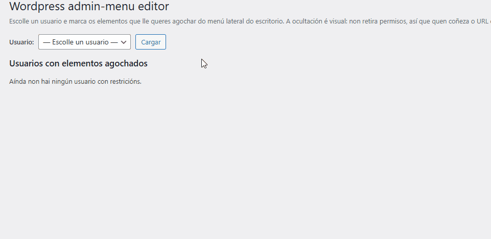

<div align="center">

<h1>
    <table style="border:0">
    <tr style="border:0">
        <td align="center" valign="middle" style="border:0">
        <picture>
            <source media="(prefers-color-scheme: dark)" srcset="https://cdn.simpleicons.org/wordpress/white">
            
        </picture>
        </td>
        <td valign="middle" style="border:0">
        <strong>Wordpress</strong><br>
        Admin-menu editor
        </td>
    </tr>
    </table>
</h1>

**Plugin de WordPress que permite editar usuario a usuario o que cada un ve no panel de administración.**




</div>

## Por que

Ao xestionar moitas webs nas que tiña que darlle acceso a máis usuarios, precisaba facer máis sinxelo (e menos perigoso) que un usuario entrase no menú de administración. Os plugins que había ían por rol; eu precisaba ir **usuario a usuario**.

## Funcionalidades

- Configuración individual **por usuario**, non por rol.
- Árbore completa de menús e submenús, incluídos os que rexistran outros plugins (WooCommerce, Yoast, Elementor…).
- Buscador para filtrar elementos e botóns de **marcar / desmarcar todo** (só afectan ao visíbel tras filtrar).
- Ao marcar un menú principal márcanse automaticamente os seus submenús.
- Táboa resumo con todos os usuarios que xa teñen restricións.
- Salvagarda antibloqueo: a propia pantalla do plugin nunca se agocha a quen ten a capacidade `edit_users`.
- Ligazón **Axustes** directa dende a lista de plugins.
- Sen táboas propias, sen dependencias e sen ficheiros de CSS/JS externos.
- Limpeza automática: bórranse os datos ao eliminar un usuario e ao desinstalar o plugin.

O plugin non pode ser máis sinxelo: engade unha pantalla en **Usuarios → Wordpress admin-menu editor** onde escolles un usuario e marcas que elementos lle queres agochar; menús principais completos (Entradas, Plugins, Axustes…) ou submenús soltos (*Axustes → Ligazóns permanentes*, por exemplo).

> **⚠️ IMPORTANTE:** a ocultación é **visual**. O elemento desaparece do menú, pero a páxina segue sendo accesíbel se o usuario escribe o URL directo e o seu rol ten permiso. Para un bloqueo real hai que retirarlle capacidades ao rol (iso non o fai este plugin).

## Congifuración

### Requisitos

| | |
|---|---|
| WordPress | 5.6 ou superior |
| PHP | 7.2 ou superior |
| Capacidade | `edit_users` para ver e usar a pantalla |
| Dependencias | ningunha (o CSS e o JS van inline) |

### Instalación: Opción A — Subir un ZIP dende o escritorio

1. Comprime a carpeta do plugin nun ficheiro `.zip`.
2. No escritorio de WordPress: **Plugins → Engadir novo → Subir complemento**.
3. Escolle o ZIP, preme **Instalar agora** e despois **Activar**.

### Instalación: Opción B — FTP ou xestor de ficheiros do aloxamento

1. Sube a carpeta completa a `wp-content/plugins/wp-admin-menu-editor/`.
2. No escritorio: **Plugins** e activa **Wordpress admin-menu editor**.

Non crea táboas nin require configuración inicial: a configuración gárdase nos metadatos de cada usuario.

## Uso

1. Entra en **Usuarios → Wordpress admin-menu editor**.
2. Escolle o usuario no despregábel e preme **Cargar**.
3. Marca os elementos que lle queres agochar (podes filtrar co buscador).
4. **Gardar cambios**.

Se entras sen escoller usuario verás a táboa resumo cos usuarios que xa teñen elementos agochados e cantos son.

> Se te agochaches o menú *Usuarios* a ti mesmo, entra directamente polo URL:
> `https://atuaweb.com/wp-admin/users.php?page=wp-admin-menu-editor`


## Preguntas frecuentes

**Se agocho *Plugins* a un usuario, xa non pode instalar plugins?**
Non. Só deixa de ver a entrada no menú. Se o seu rol ten a capacidade e coñece o URL, entra igual. Para bloquear de verdade hai que tocar as capacidades do rol.

**Podo aplicalo a un rol enteiro?**
Non; o plugin é deliberadamente por usuario. Para varios usuarios hai que repetir a configuración en cada un.

**Agocheime a min mesmo o menú *Usuarios*.**
A pantalla do plugin nunca se agocha a quen ten `edit_users`, así que podes volver polo URL directo `wp-admin/users.php?page=wp-admin-menu-editor`.

**Non aparecen os menús dun plugin novo.**
Recarga a pantalla: a árbore constrúese en tempo real a partir do menú real da instalación, así que só aparece o que xa está rexistrado.

**Que pasa se desactivo o plugin?**
Todos os menús volven verse. A configuración consérvase; só se borra ao desinstalar.

## Estrutura do proxecto

```
wp-admin-menu-editor/
├── wp-admin-menu-editor.php   # Todo o plugin: pantalla, captura, ocultación, gardado, CSS e JS inline
├── uninstall.php              # Limpeza dos metadatos ao desinstalar
├── assets/
│   ├── docs/HOWTO.md          # Detalle técnico
│   └── img/                   # GIF de mostra
└── LICENSE
```

## Historial de versións

| Versión | Cambios |
|---|---|
| 1.0.0 | Versión inicial: pantalla por usuario, árbore completa de menús e submenús, buscador, marcar/desmarcar todo, táboa resumo, salvagarda antibloqueo e limpeza ao desinstalar. |

## Licenza

GPL-2.0-or-later. Consulta o ficheiro [LICENSE](LICENSE).

## Autor

[Ismael Castiñeira](https://ipardelo.es)

```bash
VIVA GHALISIA E A COSTA DA MORTE! 💀
```
